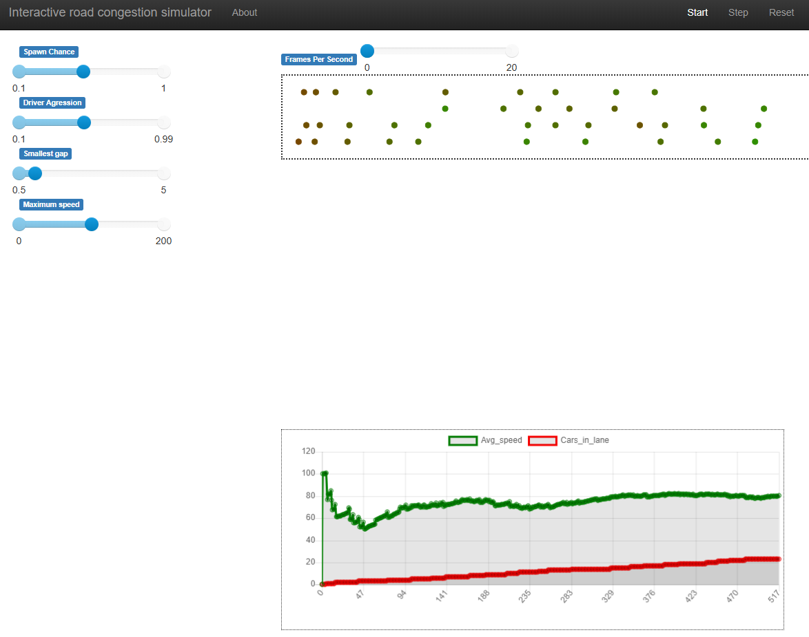

# AABMSHTC
An agent based model for the simulation of highway traffic congestion.

## Usage
There are multiple ways of using the model. An interactive server can
be started by changing to the source directory and running the server.py
file.
```
cd src
python server.py
```
This will open up a browser window where parameters can be selected,
and the result visualized.

Use the sliders to change the initial conditions and press reset to commit
the changes to the model, finally press start to begin the run.
The colors of the dots represent the speed, with bright green indicating
that a car is at its maximum speed, and dark red indicating that a car is
severly slowed.
The line graph below shows how the average speed and number of cars per lane
varies over time.
