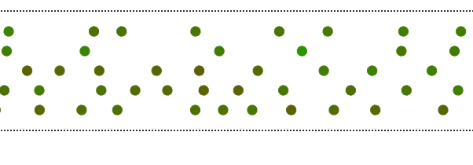

# AABMSHTC
An agent based model for the simulation of highway traffic congestion.

## Usage
There are multiple ways of using the model. An interactive server can
be started by changing to the source directory and running the server.py
file.
```
cd src
python server.py
```
This will open up a browser window where parameters can be selected,
and the result visualized.
